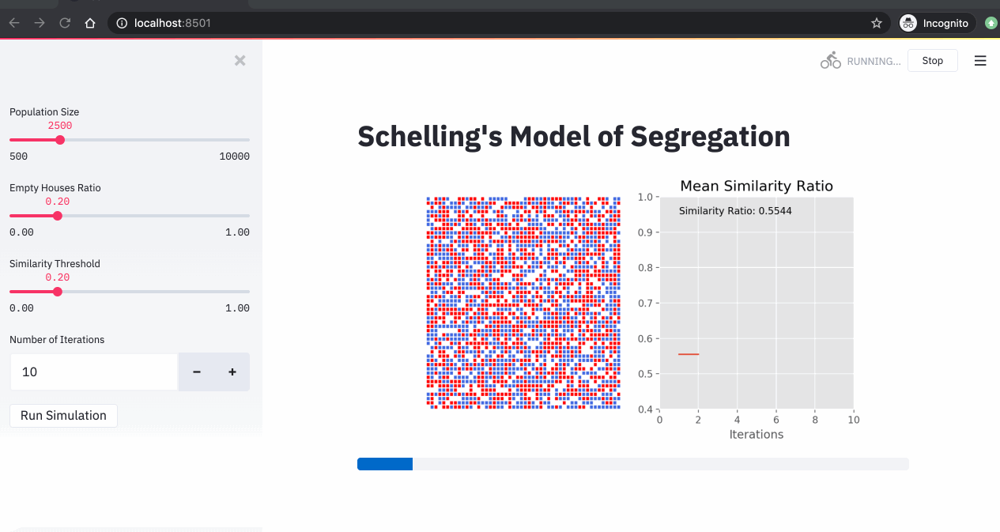

# Implementation of schelling segregation model using Python and Streamlit

* Source Code for my blog post: [An Implementation of Schelling Segregation Model using Python and Streamlit](http://adilmoujahid.com/posts/2020/05/streamlit-python-schelling/)

<div style="display:block;margin:auto;height:80%;width:80%">
  
</div>

# Dependencies

- Works with ```Python 3.7``` 
- You'll need the following libraries: ```Numpy```, ```Matplotlib``` and ```Streamlit```
- I recommend using [Anaconda's Python distribution](https://www.continuum.io/downloads). Anaconda has ```Numpy``` and ```Matplotlib``` installed.
- You'll need to install ```Streamlit``` using the following command ```pip install streamlit```

# Visit my Blog : http://adilmoujahid.com
